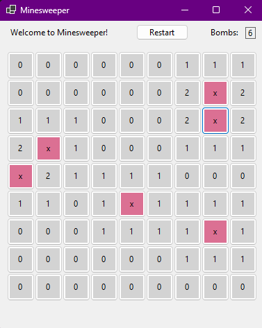
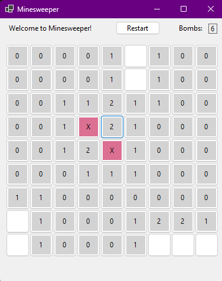

<a id="readme-top"></a>

<!-- PROJECT LOGO -->
<br />
<div align="center">
  <a href="https://github.com/hawwokitty/MineSweeper2">
    
  </a>

<h3 align="center">Minesweeper 2</h3>

  <p align="center">
    I was forced to make Minesweeper in 3 days—did it in less!
  </p>
</div>

<!-- ABOUT THE PROJECT -->
## About The Project
<p>Literally, it’s Minesweeper. Click tiles, avoid bombs, win (or don't).</p>

### Built With
* C#
* Windows Forms

<!-- GETTING STARTED -->
## Getting Started

### Prerequisites

* No dependencies needed, just run the executable!
* Oh, I think you do need .NET 9 though

### Installation

1. Clone the repo:
   ```sh
   git clone https://github.com/hawwokitty/MineSweeper2.git
   cd MineSweeper2
   ```
2. Open the project in Visual Studio and run it.

<!-- USAGE EXAMPLES -->
## Usage

Once the game is running, you can:
* Click tiles to reveal numbers or bombs
* Use logic (or vibes, aka right click) to mark bombs with flags
* Try not to explode

<div align="center">
    
</div>

